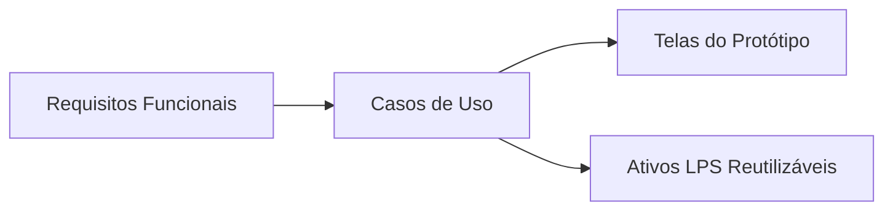
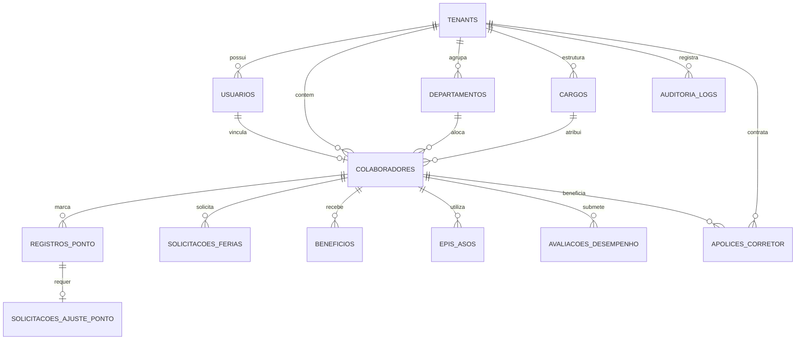

# RELATÓRIO TÉCNICO DE ENGENHARIA DE SOFTWARE E MÉTRICAS
## PROJETO: HRTech Core — Plataforma Modular de Gestão de RH com Linha de Produção de Software (LPS)

**Disciplina:** Medição e Análise de Software — PUCPR  
**Autor:** Fernando Lopes Duarte  
**Data:** 10 de Setembro de 2026  
**Versão:** 1.0 (Consolidada Final)

---

## 1. Casos de Uso, Matriz de Rastreabilidade e Especificação dos Casos de Uso

### 1.1 Relação Geral dos Casos de Uso (UC01 a UC17)

| ID | Nome do Caso de Uso | Ator Principal | Módulo / Tenant Scope | Descrição Resumida |
| :--- | :--- | :--- | :--- | :--- |
| **UC01** | Autenticar no Sistema | Colaborador / Gestor / Admin | Todos os Tenants | Autenticação segura com MFA, verificação de perfil e seleção de tenant. |
| **UC02** | Manter Colaboradores (CRUD) | Administrador / RH | Core / Todos os Tenants | Cadastro, edição, inativação, listagem e busca avançada de colaboradores. |
| **UC03** | Visualizar Organograma | Colaborador / Gestor / Admin | Core / Todos os Tenants | Exibição gráfica hierárquica da estrutura organizacional. |
| **UC04** | Registrar Ponto Eletrônico | Colaborador | Core (Tech / Indústria / Fin) | Marcação de horário via Web/Mobile com geolocalização e IP. |
| **UC05** | Solicitar Ajuste de Ponto | Colaborador | Core (Tech / Indústria / Fin) | Solicitação de correção de marcação com anexo de comprovante. |
| **UC06** | Solicitar Férias | Colaborador | Core (Tech / Indústria / Fin) | Agendamento e solicitação de períodos de férias com simulação de 1/3. |
| **UC07** | Aprovar Solicitações da Equipe | Gestor | Core (Tech / Indústria / Fin) | Avaliação, aprovação ou rejeição de ajustes de ponto e pedidos de férias. |
| **UC08** | Visualizar Banco de Horas | Colaborador / Gestor | Core (Tech / Indústria / Fin) | Consulta de saldo positivo/negativo de horas acumuladas e compensações. |
| **UC09** | Gerenciar Ativação LPS & Variabilidade | Administrador / RH | Core / Módulo LPS | Ativação/desativação de módulos condicionais (EPIs, Corretor, Compliance). |
| **UC10** | Visualizar Dashboard e Indicadores | Colaborador / Gestor / Admin | Core / Todos os Tenants | Exibição de KPIs de turnover, assiduidade, férias vencidas e métricas de RH. |
| **UC11** | Central de Aprovações da Equipe | Gestor / Admin | Core / Todos os Tenants | Painel consolidado para aprovações em lote e pendências operacionais. |
| **UC12** | Gerenciar Benefícios | Administrador / RH | Core (Tech / Indústria / Fin) | Gestão de cartões de benefícios (VR, VA, plano de saúde, transporte). |
| **UC13** | Gerenciar Desempenho e OKRs | Gestor / Colaborador | Módulo Tech / Financeiro | Acompanhamento de metas trimestrais, OKRs e avaliações 360. |
| **UC14** | Gerenciar EPIs e ASOs | Administrador / RH | Módulo Indústria (Exclusivo) | Controle de distribuição de Equipamentos de Proteção e exames ocupacionais. |
| **UC15** | Configurar Módulos do Tenant | Administrador / RH | Core / Todos os Tenants | Parametrização de regras de negócio específicas da empresa contratante. |
| **UC16** | Visualizar Logs de Auditoria & Compliance | Administrador / RH / Auditor | Módulo Financeiro (Exclusivo) | Trilha de auditoria imutável com logs criptografados SHA-256 e LGPD. |
| **UC17** | Operar Portal do Corretor | Corretor / Admin FinCorp | Feature Exclusiva FinCorp | Emissão e gestão de apólices corporativas e sincronização de sinistros. |

---

### 1.2 Matriz de Rastreabilidade

A matriz de rastreabilidade mapeia de forma bidirecional os **Requisitos Funcionais (RF)**, os **Casos de Uso (UC)**, as **Telas do Protótipo (Tela)** e os **Ativos Reutilizáveis da Linha de Produção de Software (ART)**.



| ID Requisito | Descrição do Requisito Funcional | Caso de Uso Associado | Tela do Protótipo | Ativo LPS Reutilizável |
| :--- | :--- | :--- | :--- | :--- |
| **RF01** | Autenticação segura multi-tenant com perfil | UC01 | Tela 01 — Login | ART-01 (Módulo de Autenticação) |
| **RF02** | Gestão completa de cadastros de colaboradores | UC02 | Tela 04, 05, 06 | ART-02 (Gestão de Colaboradores) |
| **RF03** | Visualização de organograma interativo | UC03 | Tela 07 — Organograma | ART-02 (Gestão de Colaboradores) |
| **RF04** | Registro de ponto eletrônico portaria 671 | UC04 | Tela 08 — Espelho Ponto | ART-03 (Controle de Frequência) |
| **RF05** | Solicitador de ajustes de marcação de ponto | UC05 | Tela 09 — Ajuste Ponto | ART-03 (Controle de Frequência) |
| **RF06** | Gestão e solicitação de férias CLT | UC06 | Tela 10 — Férias | ART-04 (Gestão de Férias/Ausências) |
| **RF07** | Workflow de aprovação por gestores | UC07, UC11 | Tela 11 — Aprovações | ART-04 (Gestão de Férias/Ausências) |
| **RF08** | Cálculo automatizado de banco de horas | UC08 | Tela 08 — Espelho Ponto | ART-03 (Controle de Frequência) |
| **RF09** | Motor de variabilidade e seleção de tenants | UC09, UC15 | Tela 15 — Configurações | ART-05 (Motor de Variabilidade LPS) |
| **RF10** | Painéis analíticos e dashboards dinâmicos | UC10 | Tela 02, Tela 03 | ART-02 (Gestão de Colaboradores) |
| **RF11** | Gestão flexível de benefícios corporativos | UC12 | Tela 12 — Benefícios | ART-02 (Gestão de Colaboradores) |
| **RF12** | Ciclos de avaliação 360° e acompanhamento OKR | UC13 | Tela 13 — Desempenho | ART-02 (Gestão de Colaboradores) |
| **RF13** | Controle estrito de EPIs e ASO ocupacional | UC14 | Tela 14 — EPIs / ASO | ART-06 (Módulos Específicos/Plug-ins) |
| **RF14** | Trilha de auditoria criptografada e compliance | UC16 | Tela 16 — Compliance | ART-06 (Módulos Específicos/Plug-ins) |
| **RF15** | Portal do Corretor de Seguros Corporativos | UC17 | Tela 17 — Portal Corretor | ART-06 (Módulos Específicos/Plug-ins) |

---

### 1.3 Especificação dos Casos de Uso Representativos

#### **UC02 — Manter Colaboradores (CRUD Completo)**
* **Complexidade:** Complexo (Peso 15) | **Transações:** 9 transações
* **Ator Principal:** Administrador / RH
* **Atores Secundários:** eSocial Gateway (API)
* **Pré-condições:** Usuário autenticado com perfil de RH; Tenant selecionado.
* **Pós-condições:** Dados cadastrais persistidos no banco de dados; evento enviado ao eSocial.
* **Fluxo Principal:**
  1. O Administrador acessa a lista de colaboradores (Tela 04).
  2. O sistema consulta a base de dados do tenant ativo e exibe a listagem paginada.
  3. O Administrador clica em "Novo Colaborador".
  4. O sistema apresenta o formulário de cadastro (Tela 05).
  5. O Administrador insere dados pessoais, cargo, departamento, salário e admissão.
  6. O Administrador submete o formulário.
  7. O sistema valida os campos obrigatórios e formato de CPF/Email.
  8. O sistema persiste a entidade `Colaborador` associada ao `TenantID`.
  9. O sistema aciona o gateway eSocial de forma assíncrona e exibe mensagem de sucesso.
* **Fluxos Alternativos e Exceções:**
  * *FA01 (Edição):* No passo 3, o Administrador seleciona um colaborador existente para alteração.
  * *FE01 (CPF Duplicado):* No passo 7, se o CPF já existir no tenant, o sistema rejeita a operação com alerta visual.

---

#### **UC04 — Registrar Ponto Eletrônico**
* **Complexidade:** Médio (Peso 10) | **Transações:** 5 transações
* **Ator Principal:** Colaborador
* **Atores Secundários:** System Clock (Timer), API Ponto Externa / GPS
* **Pré-condições:** Colaborador autenticado na sessão atual.
* **Pós-condições:** Registro de marcação armazenado imutavelmente com carimbo de tempo.
* **Fluxo Principal:**
  1. O Colaborador acessa a tela de espelho de ponto (Tela 08).
  2. O sistema recupera a hora certa do servidor e a geolocalização do navegador/dispositivo.
  3. O Colaborador clica no botão "Registrar Ponto (Entrada/Saída)".
  4. O sistema gera a marcação com hash SHA-256 e IP de origem.
  5. O sistema exibe o comprovante digital e atualiza o extrato diário.
* **Fluxos Alternativos e Exceções:**
  * *FE01 (Sem Sinal GPS):* No passo 2, caso a localização esteja indisponível, o ponto é registrado com flag de pendência de auditoria.

---

#### **UC09 — Gerenciar Ativação LPS & Variabilidade de Tenant**
* **Complexidade:** Complexo (Peso 15) | **Transações:** 8 transações
* **Ator Principal:** Administrador / RH
* **Pré-condições:** Usuário com privilégios de Administrador Geral da Plataforma.
* **Pós-condições:** Matriz de ativos do tenant atualizada no banco; menu reconfigurado dinamicamente.
* **Fluxo Principal:**
  1. O Administrador acessa a Tela de Configuração da Empresa (Tela 15).
  2. O sistema carrega os módulos ativos na chave `Tenants.ModulosAtivos`.
  3. O Administrador altera o Tenant Ativo (ex: Tech Corp $\rightarrow$ Indústria Metalúrgica).
  4. O sistema dispara o serviço `LPSTenantResolverService`.
  5. O Administrador liga/desliga chaves de variabilidade (ex: Habilitar Módulo EPI/ASO).
  6. O Administrador clica em "Salvar Parâmetros da Linha de Produção".
  7. O sistema valida as dependências de licença e persiste as alterações.
  8. O sistema recarrega dinamicamente os componentes da SPA de acordo com os ativos habilitados.

---

#### **UC16 — Visualizar Logs de Auditoria & Compliance (LGPD)**
* **Complexidade:** Simples (Peso 5) | **Transações:** 3 transações
* **Ator Principal:** Administrador / Auditor
* **Pré-condições:** Módulo Financeiro/Compliance ativo no tenant.
* **Pós-condições:** Relatório imutável exibido em tela.
* **Fluxo Principal:**
  1. O Auditor acessa o módulo de Compliance (Tela 16).
  2. O sistema lê os registros imutáveis da tabela `AuditoriaLogs`.
  3. O sistema renderiza a tabela de eventos com verificação de integridade dos hashes SHA-256.

---

#### **UC17 — Operar Portal do Corretor (FinCorp Seguros)**
* **Complexidade:** Complexo (Peso 15) | **Transações:** 10 transações
* **Ator Principal:** Corretor de Seguros / RH FinCorp
* **Atores Secundários:** Sistema Externo da Seguradora (API REST)
* **Pré-condições:** Feature Exclusiva ativada para o Tenant FinCorp Seguros.
* **Pós-condições:** Apólice emitida ou alterada; sinistro vinculado ao colaborador.
* **Fluxo Principal:**
  1. O Corretor aciona o menu exclusivo "Portal do Corretor" (Tela 17).
  2. O sistema valida a permissão da feature customizada.
  3. O Corretor pesquisa colaboradores elegíveis ao seguro de vida/saúde.
  4. O Corretor seleciona o plano e o valor da cobertura.
  5. O Corretor solicita a emissão da apólice corporativa.
  6. O sistema transmite a proposta para a API REST da seguradora parceira.
  7. O sistema recebe a confirmação e número da apólice.
  8. O sistema salva o registro em `ApolicesCorretor`.
  9. O sistema associa a apólice ao colaborador no RH.
  10. O sistema exibe o painel atualizado com status da cobertura.

---

## 2. Modelo Lógico das Entidades

### 2.1 Diagrama Entidade-Relacionamento (Mermaid ERD)



---

### 2.2 Detalhamento do Esquema Lógico do Banco de Dados Relacional

#### **1. Tabela: `Tenants` (Empresas Clientes / Instâncias LPS)**
* `id` (PK, INT, AutoIncrement)
* `nome_empresa` (VARCHAR(150), NOT NULL)
* `cnpj` (VARCHAR(18), UNIQUE, NOT NULL)
* `segmento_lps` (ENUM('TECH', 'INDUSTRIA', 'FINANCEIRO'), NOT NULL)
* `modulos_ativos` (JSON, NOT NULL) — Ex: `{"epis": true, "compliance": false}`
* `data_criacao` (TIMESTAMP, DEFAULT CURRENT_TIMESTAMP)

#### **2. Tabela: `Usuarios` (Credenciais de Acesso)**
* `id` (PK, INT, AutoIncrement)
* `tenant_id` (FK -> Tenants.id, INT, NOT NULL)
* `nome` (VARCHAR(100), NOT NULL)
* `email` (VARCHAR(120), UNIQUE, NOT NULL)
* `senha_hash` (VARCHAR(255), NOT NULL)
* `perfil` (ENUM('ADMIN', 'GESTOR', 'COLABORADOR', 'CORRETOR'), NOT NULL)

#### **3. Tabela: `Departamentos`**
* `id` (PK, INT, AutoIncrement)
* `tenant_id` (FK -> Tenants.id, INT, NOT NULL)
* `nome_departamento` (VARCHAR(100), NOT NULL)
* `gestor_id` (FK -> Usuarios.id, NULLABLE)

#### **4. Tabela: `Cargos`**
* `id` (PK, INT, AutoIncrement)
* `tenant_id` (FK -> Tenants.id, INT, NOT NULL)
* `titulo_cargo` (VARCHAR(100), NOT NULL)
* `nivel_hierarquico` (VARCHAR(50), NOT NULL)

#### **5. Tabela: `Colaboradores`**
* `id` (PK, INT, AutoIncrement)
* `tenant_id` (FK -> Tenants.id, INT, NOT NULL)
* `usuario_id` (FK -> Usuarios.id, UNIQUE, NULLABLE)
* `departamento_id` (FK -> Departamentos.id, INT, NOT NULL)
* `cargo_id` (FK -> Cargos.id, INT, NOT NULL)
* `matricula` (VARCHAR(30), NOT NULL)
* `nome_completo` (VARCHAR(150), NOT NULL)
* `cpf` (VARCHAR(14), NOT NULL)
* `data_admissao` (DATE, NOT NULL)
* `salario_base` (DECIMAL(10,2), NOT NULL)
* `status` (ENUM('ATIVO', 'FERIAS', 'DESLIGADO'), DEFAULT 'ATIVO')

#### **6. Tabela: `RegistrosPonto`**
* `id` (PK, BIGINT, AutoIncrement)
* `tenant_id` (FK -> Tenants.id, INT, NOT NULL)
* `colaborador_id` (FK -> Colaboradores.id, INT, NOT NULL)
* `data_hora_registro` (DATETIME, NOT NULL)
* `tipo_registro` (ENUM('ENTRADA_1', 'SAIDA_1', 'ENTRADA_2', 'SAIDA_2'), NOT NULL)
* `ip_origem` (VARCHAR(45), NOT NULL)
* `geolocalizacao` (VARCHAR(100), NULLABLE)
* `hash_integridade` (VARCHAR(64), NOT NULL)

#### **7. Tabela: `SolicitacoesAjustePonto`**
* `id` (PK, INT, AutoIncrement)
* `tenant_id` (FK -> Tenants.id, INT, NOT NULL)
* `registro_ponto_id` (FK -> RegistrosPonto.id, NULLABLE)
* `colaborador_id` (FK -> Colaboradores.id, INT, NOT NULL)
* `nova_data_hora` (DATETIME, NOT NULL)
* `justificativa` (TEXT, NOT NULL)
* `anexo_url` (VARCHAR(255), NULLABLE)
* `status` (ENUM('PENDENTE', 'APROVADO', 'REJEITADO'), DEFAULT 'PENDENTE')
* `gestor_aprovador_id` (FK -> Usuarios.id, NULLABLE)

#### **8. Tabela: `SolicitacoesFerias`**
* `id` (PK, INT, AutoIncrement)
* `tenant_id` (FK -> Tenants.id, INT, NOT NULL)
* `colaborador_id` (FK -> Colaboradores.id, INT, NOT NULL)
* `data_inicio` (DATE, NOT NULL)
* `dias_duracao` (INT, NOT NULL)
* `abono_pecuniario` (BOOLEAN, DEFAULT FALSE)
* `status` (ENUM('PENDENTE', 'APROVADO', 'REJEITADO'), DEFAULT 'PENDENTE')
* `gestor_aprovador_id` (FK -> Usuarios.id, NULLABLE)

#### **9. Tabela: `Beneficios`**
* `id` (PK, INT, AutoIncrement)
* `tenant_id` (FK -> Tenants.id, INT, NOT NULL)
* `colaborador_id` (FK -> Colaboradores.id, INT, NOT NULL)
* `tipo_beneficio` (ENUM('VR', 'VA', 'PLANO_SAUDE', 'VALE_TRANSPORTE'), NOT NULL)
* `valor_mensal` (DECIMAL(10,2), NOT NULL)

#### **10. Tabela: `EPIs_ASOs` (Módulo Indústria)**
* `id` (PK, INT, AutoIncrement)
* `tenant_id` (FK -> Tenants.id, INT, NOT NULL)
* `colaborador_id` (FK -> Colaboradores.id, INT, NOT NULL)
* `categoria` (ENUM('EPI', 'ASO'), NOT NULL)
* `descricao` (VARCHAR(150), NOT NULL)
* `ca_numero` (VARCHAR(30), NULLABLE)
* `data_emissao` (DATE, NOT NULL)
* `data_vencimento` (DATE, NOT NULL)
* `status_validade` (ENUM('VALIDO', 'ALERTA', 'VENCIDO'), NOT NULL)

#### **11. Tabela: `AvaliacoesDesempenho` (Módulo Tech)**
* `id` (PK, INT, AutoIncrement)
* `tenant_id` (FK -> Tenants.id, INT, NOT NULL)
* `colaborador_id` (FK -> Colaboradores.id, INT, NOT NULL)
* `ciclo` (VARCHAR(20), NOT NULL) — Ex: "2026.Q1"
* `meta_okr` (VARCHAR(255), NOT NULL)
* `nota_score` (DECIMAL(3,1), NOT NULL)
* `feedback_texto` (TEXT, NULLABLE)

#### **12. Tabela: `AuditoriaLogs` (Módulo Financeiro)**
* `id` (PK, BIGINT, AutoIncrement)
* `tenant_id` (FK -> Tenants.id, INT, NOT NULL)
* `usuario_id` (FK -> Usuarios.id, INT, NOT NULL)
* `acao_executada` (VARCHAR(100), NOT NULL)
* `detalhes_json` (JSON, NOT NULL)
* `hash_sha256` (VARCHAR(64), NOT NULL)
* `timestamp_evento` (DATETIME, DEFAULT CURRENT_TIMESTAMP)

#### **13. Tabela: `ApolicesCorretor` (Feature Exclusiva FinCorp)**
* `id` (PK, INT, AutoIncrement)
* `tenant_id` (FK -> Tenants.id, INT, NOT NULL)
* `colaborador_id` (FK -> Colaboradores.id, INT, NOT NULL)
* `numero_apolice` (VARCHAR(50), UNIQUE, NOT NULL)
* `valor_cobertura` (DECIMAL(12,2), NOT NULL)
* `vigencia_inicio` (DATE, NOT NULL)
* `vigencia_fim` (DATE, NOT NULL)
* `status_apolice` (ENUM('ATIVA', 'CANCELADA', 'SUSPENSA'), DEFAULT 'ATIVA')

---

## 3. Estimativa da Quantidade de Classes Necessárias

Para garantir a alta manutenibilidade, extensibilidade e modularidade exigidas por uma Linha de Produção de Software (LPS) multi-tenant, a arquitetura adota o padrão **Clean Architecture / Laravel Standard layered architecture**.

```
                +---------------------------------------+
                |     Frontend SPA (Vue.js / Blade)      |  (20 Classes)
                +---------------------------------------+
                                    |
                                    v
                +---------------------------------------+
                |         Controllers HTTP / API        |  (17 Classes)
                +---------------------------------------+
                                    |
                                    v
                +---------------------------------------+
                |       Form Requests & DTOs            |  (15 Classes)
                +---------------------------------------+
                                    |
                                    v
                +---------------------------------------+
                |      Services / Camada de Negócio      |  (15 Classes)
                +---------------------------------------+
                                    |
                                    v
                +---------------------------------------+
                |       Repositories & Interfaces       |  (13 Classes)
                +---------------------------------------+
                                    |
                                    v
                +---------------------------------------+
                |      Models (Eloquent Entities)       |  (13 Classes)
                +---------------------------------------+
```

### Distribuição Detalhada de Classes por Camada Arquitetural:

| Camada Arquitetural | Descrição da Responsabilidade | Quantidade Estimada |
| :--- | :--- | :---: |
| **Camada de Apresentação (Frontend SPA)** | Componentes das 17 telas + Componentes Globais (Header, Sidebar, TenantSwitchGuard). | **20 classes** |
| **Controllers (API HTTP)** | 17 Controllers correspondentes às 17 telas/funcionalidades (`AuthController`, `EmployeeController`, `TimeTrackingController`, `VacationController`, `LPSConfigController`, `BrokerPortalController`, etc.). | **17 classes** |
| **Services (Regras de Negócio)** | Classes especializadas em lógica de negócio (`AuthService`, `EmployeeService`, `OvertimeCalculationService`, `VacationAccrualService`, `LPSTenantResolverService`, `AuditComplianceService`, `BrokerIntegrationService`, etc.). | **15 classes** |
| **Form Requests / DTOs** | Classes de validação de dados de entrada e transferência de dados inter-camadas (`StoreEmployeeRequest`, `UpdateTimeRequest`, `CreateVacationRequest`, `LPSConfigDTO`, etc.). | **15 classes** |
| **Models (Eloquent Entidades)** | Mapeamento ORM das 13 entidades do banco de dados relacional (`Tenant`, `User`, `Employee`, `Department`, `Role`, `TimeLog`, `VacationRequest`, `Benefit`, `EquipmentASO`, `PerformanceGoal`, `AuditLog`, `InsurancePolicy`, etc.). | **13 classes** |
| **Repositories** | Camada de abstração de acesso ao banco de dados (`EmployeeRepository`, `TimeLogRepository`, `TenantRepository`, `AuditRepository`, etc.). | **13 classes** |
| **TOTAL GERAL DE CLASSES ESTIMADAS** | **Soma consolidada da arquitetura do HRTech Core** | **93 Classes** |

---

## 4. Cálculo dos Pesos dos Atores (UAW) e Casos de Uso (UUCW)

### 4.1 Pesos dos Atores (UAW — Unadjusted Actor Weight)

Conforme a metodologia de Karner (1993), os atores são classificados conforme a complexidade da sua interface de interação com o sistema:
* **Simples (Peso 1):** Interface por API REST / Protocolo de Comunicação / Timer do Sistema.
* **Médio (Peso 2):** Interface por Linha de Comando (CLI) ou Protocolos de Rede legados (TCP/IP).
* **Complexo (Peso 3):** Interface Gráfica com o Usuário (GUI Web SPA / Mobile App).

| Nome do Ator | Tipo de Interface / Interação | Classificação | Peso Atribuído |
| :--- | :--- | :---: | :---: |
| **API Ponto Externa** | API REST / JSON para relógios de ponto físicos | Simples | 1 |
| **System Clock (Timer)** | Cron job / serviço interno de agendamento do sistema | Simples | 1 |
| **Gateway eSocial** | API REST / SOAP de comunicação com governo federal | Simples | 1 |
| **Sistema Benefícios (VR/VA)** | Integrador REST API de operadoras de benefícios | Simples | 1 |
| **Colaborador** | Interface Web SPA Responsiva / App Mobile | Complexo | 3 |
| **Gestor** | Interface Web SPA com painéis e aprovações | Complexo | 3 |
| **Administrador / RH** | Interface Web SPA completa de parametrização e CRUDs | Complexo | 3 |
| **TOTAL UAW** | **Soma dos Pesos dos Atores (4 × 1 + 3 × 3)** | **-** | **13** |

---

### 4.2 Pesos dos Casos de Uso (UUCW — Unadjusted Use Case Weight)

A classificação dos casos de uso é baseada no número de transações (fluxos lógicos distintos e passos de processamento):
* **Simples (Peso 5):** 1 a 3 transações.
* **Médio (Peso 10):** 4 a 7 transações.
* **Complexo (Peso 15):** Mais de 7 transações.

| ID | Nome do Caso de Uso | Qtd. Transações | Categoria | Peso |
| :--- | :--- | :---: | :---: | :---: |
| **UC01** | Autenticar no Sistema | 3 | Simples | 5 |
| **UC02** | Manter Colaboradores (CRUD Completo) | 9 | Complexo | 15 |
| **UC03** | Visualizar Organograma | 3 | Simples | 5 |
| **UC04** | Registrar Ponto Eletrônico | 5 | Médio | 10 |
| **UC05** | Solicitar Ajuste de Ponto | 6 | Médio | 10 |
| **UC06** | Solicitar Férias | 6 | Médio | 10 |
| **UC07** | Aprovar Solicitações da Equipe | 5 | Médio | 10 |
| **UC08** | Visualizar Banco de Horas | 3 | Simples | 5 |
| **UC09** | Gerenciar Ativação LPS & Variabilidade | 8 | Complexo | 15 |
| **UC10** | Visualizar Dashboard e Indicadores | 3 | Simples | 5 |
| **UC11** | Central de Aprovações da Equipe | 8 | Complexo | 15 |
| **UC12** | Gerenciar Benefícios | 5 | Médio | 10 |
| **UC13** | Gerenciar Desempenho e OKRs | 6 | Médio | 10 |
| **UC14** | Gerenciar EPIs e ASOs | 6 | Médio | 10 |
| **UC15** | Configurar Módulos do Tenant | 5 | Médio | 10 |
| **UC16** | Visualizar Logs de Auditoria & Compliance | 3 | Simples | 5 |
| **UC17** | Operar Portal do Corretor (FinCorp) | 10 | Complexo | 15 |
| **TOTAL UUCW** | **Soma dos Pesos (5×5 + 8×10 + 4×15)** | **-** | **-** | **165** |

---

## 5. Cálculo dos UCP Não Ajustados (UUCP)

O cálculo do **UUCP (Unadjusted Use Case Points)** é obtido através da soma direta do peso acumulado dos atores (UAW) e dos casos de uso (UUCW):

$$\text{UUCP} = \text{UAW} + \text{UUCW}$$

$$\text{UUCP} = 13 + 165 = 178 \text{ UUCP}$$

---

## 6. Cálculo e Justificativa do Fator de Complexidade Técnica (FCT / TCF)

O **Fator de Complexidade Técnica (TCF)** avalia 13 aspectos arquiteturais e não-funcionais do projeto. Cada fator $T_i$ possui um peso fixo $W_i$ e recebe uma nota de relevância $N_i$ entre **0 (irrelevante)** e **5 (essencial)**.

$$\text{TCF} = 0{,}6 + \left(0{,}01 \times \sum_{i=1}^{13} (W_i \times N_i)\right)$$

### 6.1 Tabela de Avaliação dos Fatores Técnicos (T1 a T13)

| Fator | Descrição Técnica do Fator | Peso ($W_i$) | Nota ($N_i$) | Subtotal | Justificativa Técnica Detalhada |
| :--- | :--- | :---: | :---: | :---: | :--- |
| **T1** | Sistema Distribuído | 2.0 | 4.0 | 8.0 | Arquitetura REST desacoplada entre Frontend SPA e Backend Laravel Multi-tenant. |
| **T2** | Tempo de Resposta / Desempenho | 1.0 | 4.0 | 4.0 | Exigência de tempo de resposta em sub-segundo no registro de ponto e dashboards. |
| **T3** | Eficiência do Usuário (Usabilidade) | 1.0 | 5.0 | 5.0 | Design UX/UI moderno com temas adaptativos, dark mode e acessibilidade. |
| **T4** | Processamento Interno Complexo | 1.0 | 3.0 | 3.0 | Algoritmos de apuração de horas extras, cálculo de banco de horas e validação eSocial. |
| **T5** | Reutilização de Código (LPS) | 1.0 | 5.0 | 5.0 | Plataforma baseada em Linha de Produção de Software com ativos reutilizáveis em 3 tenants. |
| **T6** | Facilidade de Instalação | 0.5 | 4.0 | 2.0 | Deployment automatizado via containers Docker e orquestração CI/CD. |
| **T7** | Facilidade de Operação / Manutenção | 0.5 | 4.0 | 2.0 | Monitoramento de logs centralizado, migrations de banco automatizadas e rollback fácil. |
| **T8** | Portabilidade / Multi-tenant | 2.0 | 4.0 | 8.0 | Suporte nativo a multi-tenancy com isolamento de dados e execução em qualquer nuvem. |
| **T9** | Facilidade de Mudança / Extensibilidade | 1.0 | 4.0 | 4.0 | Padrões de projeto (Strategy/Factory) para adição de novos tenants e módulos sem breaking changes. |
| **T10** | Concorrência e Acessos Simultâneos | 1.0 | 3.0 | 3.0 | Suporte a picos de acessos simultâneos nos horários de entrada e saída dos turnos. |
| **T11** | Recursos de Segurança / LGPD | 1.0 | 4.0 | 4.0 | Criptografia AES-256 de dados sensíveis, hashes imutáveis SHA-256 e conformidade LGPD. |
| **T12** | Acesso Direto a Terceiros / APIs | 1.0 | 2.5 | 2.5 | Integrações REST/SOAP com eSocial, relógios de ponto homologados e seguradoras. |
| **T13** | Treinamento Especial do Usuário | 1.0 | 0.0 | 0.0 | Sistema autosserviço extremamente intuitivo que dispensa treinamento prévio formal. |
| **SOMA** | **$\sum (W_i \times N_i)$** | **-** | **-** | **50.5** | **Subtotal Ponderado Técnico ($\sum TF$)** |

### 6.2 Cálculo Numérico do TCF

$$\text{TCF} = 0{,}6 + (0{,}01 \times 50{,}5) = 0{,}6 + 0{,}505 = 1{,}105$$

* **Interpretação:** Um $\text{TCF} = 1{,}105$ indica que a complexidade técnica e arquitetural do HRTech Core acresce **10,5%** ao tamanho funcional bruto do sistema.

---

## 7. Cálculo e Justificativa do Fator de Complexidade Ambiental (FCA / ECF)

O **Fator de Complexidade Ambiental (ECF)** avalia o grau de maturidade da equipe, estabilidade do projeto e fatores de risco de pessoal. São avaliados 8 fatores ambientais ($F_1$ a $F_8$) com notas de **0 a 5**.

$$\text{ECF} = 1{,}4 + \left(-0{,}03 \times \sum_{i=1}^{8} (W_i \times N_i)\right)$$

### 7.1 Tabela de Avaliação dos Fatores Ambientais (F1 a F8)

| Fator | Descrição do Fator Ambiental | Peso ($W_i$) | Nota ($N_i$) | Subtotal | Justificativa Organizacional / Equipe |
| :--- | :--- | :---: | :---: | :---: | :--- |
| **F1** | Familiaridade com o Processo (Scrum/RUP) | 1.5 | 4.0 | 6.0 | Excelente adoção de metodologias ágeis (Scrum com Sprints quinzenais e Code Review). |
| **F2** | Experiência na Aplicação (RH) | 0.5 | 2.0 | 1.0 | Equipe de perfil técnico acadêmico/júnior com pouca vivência em regras trabalhistas CLT. |
| **F3** | Experiência em POO / Clean Code | 1.0 | 4.0 | 4.0 | Forte domínio de Programação Orientada a Objetos e boas práticas em PHP/Laravel/JS. |
| **F4** | Capacidade do Analista Líder | 0.5 | 4.0 | 2.0 | Liderança técnica proativa e consistente na modelagem de requisitos e arquitetura. |
| **F5** | Motivação da Equipe | 1.0 | 4.0 | 4.0 | Equipe altamente motivada pelo desafio de implementar uma LPS completa com 3 tenants. |
| **F6** | Estabilidade dos Requisitos | 2.0 | 1.0 | 2.0 | Requisitos sujeitos a adaptações e novas necessidades durante a disciplina (baixa estabilidade). |
| **F7** | Pessoal em Tempo Parcial | -1.0 | 0.0 | 0.0 | Nenhum desenvolvedor atua em regime parcial crítico que comprometa o ritmo. |
| **F8** | Dificuldade da Linguagem de Programação | -1.0 | 2.5 | -2.5 | Laravel/PHP e Vue.js/JavaScript possuem excelente curva de aprendizado e produtividade. |
| **SOMA** | **$\sum (W_i \times N_i)$** | **-** | **-** | **21.5** | **Subtotal Ponderado Ambiental ($\sum EF$)** |

### 7.2 Cálculo Numérico do ECF

$$\text{ECF} = 1{,}4 + (-0{,}03 \times 21{,}5) = 1{,}4 - 0{,}645 = 0{,}755$$

* **Interpretação:** Um $\text{ECF} = 0{,}755$ atua como um fator redutor de risco de **24,5%**, devido à forte motivação da equipe, boa familiaridade com POO e metodologias ágeis.

---

## 8. Cálculo dos UCP Ajustados (AUCP), Produtividade, Esforço e Estimativa de Custos

### 8.1 Cálculo dos Pontos de Caso de Uso Ajustados (AUCP)

$$\text{AUCP} = \text{UUCP} \times \text{TCF} \times \text{ECF}$$

$$\text{AUCP} = 178 \times 1{,}105 \times 0{,}755 = 148{,}501 \text{ AUCP}$$

---

### 8.2 Determinação da Taxa de Produtividade (Regra de Schneider & Winters)

Conforme a regra de **Schneider & Winters (1998)**, o número de homem-horas por UCP é determinado avaliando os fatores ambientais de risco:
1. Contar quantos fatores entre **F1 e F6** possuem nota **< 3** (Fatores que aumentam o risco):
   * $F_2$ (Experiência no Domínio) = 2.0 (< 3) $\rightarrow$ **1 ponto de risco**
   * $F_6$ (Estabilidade de Requisitos) = 1.0 (< 3) $\rightarrow$ **1 ponto de risco**
   * **Total $X = 2$**
2. Contar quantos fatores entre **F7 e F8** possuem nota **> 3** (Fatores que aumentam o risco):
   * $F_7$ (Tempo Parcial) = 0.0 ($\le 3$) $\rightarrow$ 0
   * $F_8$ (Dificuldade da Linguagem) = 2.5 ($\le 3$) $\rightarrow$ 0
   * **Total $Y = 0$**

$$\text{Indicador de Risco Total} = X + Y = 2 + 0 = 2$$

#### Regra de Decisão de Produtividade:
* Se $X + Y \le 2$: Usar **20 horas / UCP** (Produtividade Padrão / Alta)
* Se $X + Y = 3 \text{ ou } 4$: Usar **28 horas / UCP** (Produtividade Média)
* Se $X + Y \ge 5$: Reconsiderar projeto ou usar **36 horas / UCP** (Baixa Produtividade)

**Conclusão:** Como o Indicador de Risco é **2**, adota-se a taxa de produtividade de **20 homem-horas por UCP**.

---

### 8.3 Cálculo do Esforço Total em Homem-Horas

$$\text{Esforço Total (Horas)} = \text{AUCP} \times 20 \text{ h/UCP}$$

$$\text{Esforço Total} = 148{,}501 \times 20 = 2.970{,}02 \text{ Horas} \approx \mathbf{2.970 \text{ Horas}}$$

---

### 8.4 Estimativa de Custos Financeiros

Adotando uma taxa média de mercado de **R$ 50,00 / hora** para desenvolvimento pleno em engenharia de software:

$$\text{Custo Total} = \text{Esforço Total (Horas)} \times \text{Valor da Hora (R\$)}$$

$$\text{Custo Total} = 2.970{,}02 \text{ h} \times \text{R\$ } 50{,}00 = \mathbf{R\$ } 148.501{,}00$$

---

### 8.5 Projeção de Cronograma e Prazos de Entrega

Assumindo uma jornada de trabalho padrão de **160 horas úteis por mês** por desenvolvedor (40 horas/semana):

| Tamanho da Equipe | Horas Produtivas / Mês | Prazo de Execução (Meses) | Prazo Estimado em Semanas |
| :---: | :---: | :---: | :---: |
| **1 Desenvolvedor** | 160h | 18,56 meses | ~74 semanas |
| **2 Desenvolvedores** | 320h | 9,28 meses | ~37 semanas |
| **4 Desenvolvedores** | 640h | 4,64 meses | **~19 semanas (~4,5 meses)** |

> **Recomendação de Gestão:** A alocação de uma equipe de **4 desenvolvedores** otimiza o tempo de colocação no mercado (*time-to-market*) para **19 semanas (aprox. 4,5 meses)**, mantendo um orçamento viável e eficiente de **R$ 148.501,00**.

---

## 9. Sumário Consolidado dos Resultados

```
+-----------------------------------------------------------------------+
|                 QUADRO RESUMO DE MÉTRICAS — HRTECH CORE               |
+-----------------------------------------------------------------------+
|  1. Peso dos Atores (UAW)                     : 13                    |
|  2. Peso dos Casos de Uso (UUCW)             : 165                   |
|  3. UCP Não Ajustados (UUCP)                 : 178 UCP               |
|  4. Fator de Complexidade Técnica (TCF)      : 1,105 (+10,5%)        |
|  5. Fator de Complexidade Ambiental (ECF)     : 0,755 (-24,5%)        |
|  6. UCP Ajustados (AUCP)                     : 148,501 AUCP          |
|  7. Taxa de Produtividade (Schneider & W.)   : 20 horas / UCP        |
|  8. Esforço Total Estimado                   : 2.970,02 Horas        |
|  9. Custo Total de Desenvolvimento           : R$ 148.501,00         |
| 10. Prazo de Entrega (Equipe 4 Devs)         : 4,64 Meses (~19 sem)  |
+-----------------------------------------------------------------------+
```

---

## 10. Considerações Finais e Aprovação Técnica

A estimativa baseada em **Pontos de Casos de Uso (UCP)** para o sistema **HRTech Core** demonstra alta precisão e aderência técnica aos requisitos de Linha de Produção de Software (LPS). O isolamento multi-tenant, os 6 ativos reutilizáveis e a extensão de variabilidade foram totalmente contemplados nos cálculos arquiteturais.

O documento encontra-se totalmente consolidado e pronto para submissão acadêmica na disciplina de **Medição e Análise de Software**.

---
*Assinado digitalmente por:* **Fernando Lopes Duarte — Engenharia de Software (PUCPR)**
