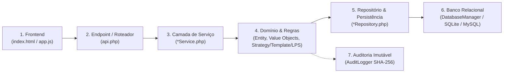

# 🛡️ Roteiro Oficial de Defesa de Autoria: Empacotamento, Reuso e Trilha de Execução (Botão ao Banco)

> **Projeto:** HRTech Core — Sistema Integrado de Gestão de RH, Folha e Segurança Ocupacional  
> **Foco da Avaliação:** Reuso de Software, Padrões de Projeto (Singleton, Template Method, Strategy), LPS (Linha de Produção de Software) e Empacotamento de Código.  
> **Equipe (5 Integrantes):** Fernando Lopes Duarte, Andryus, Felipe, Valentin, Nicholas.

---

## 📦 BLOCO 1: Como Explicar o Empacotamento para Reuso (Item 03 do Edital)

Se o professor perguntar: **"Como vocês fizeram a compactação/empacotamento de código focada em reuso? O que acontece tecnicamente nesse processo?"**

### 🎙️ Resposta Padrão da Equipe:
> *"Professor, para a técnica de empacotamento focada em reuso, nós não fizemos um simples arquivo ZIP de pastas soltas. Nós estruturamos o **HRTech Core** como uma **biblioteca de componentes reutilizáveis e autocontidos**, seguindo os padrões da indústria PHP (PSR-4 e Composer).*
> 
> *Nós criamos o script automatizado `build_package.php` que gera dois formatos de distribuição na pasta `dist/`:*
> 1. ***`hrtech-core.phar` (PHP Archive):** Um arquivo binário único e executável que compacta toda a árvore de classes (`src/`), Value Objects, Repositórios, Serviços e Padrões de Projeto, contendo um autoloader interno embutido. Qualquer outro sistema PHP pode reutilizar todo o nosso domínio com apenas uma linha: `require_once 'phar://hrtech-core.phar';`.*
> 2. ***`hrtech-core-package.zip`:** Um pacote padronizado com `composer.json`, pronto para ser publicado no Packagist ou em um repositório privado de pacotes Satis/GitLab.*
> 
> *Esse empacotamento possui zero dependências externas de runtime — depende apenas do PHP 8.2+ e extensões nativas (PDO e SQLite/MySQL). Todas as interfaces públicas de repositórios e estratégias foram isoladas para garantir desacoplamento total e máxima reutilização."*

### ⚙️ Como Demonstrar ao Vivo no Terminal:
```bash
# 1. Executar o gerador de pacotes
php -d phar.readonly=0 hrtech_backend_patterns/build_package.php

# 2. Mostrar os arquivos gerados em dist/
dir hrtech_backend_patterns\dist
# Mostra: hrtech-core.phar (binário único) e hrtech-core-package.zip
```

---

## 🗺️ BLOCO 2: Visão Geral da Trilha de Execução (Do Clique ao Banco)

Quando o professor apontar para a tela e perguntar: **"Se eu clicar neste botão, qual o caminho exato que os dados percorrem?"**, a resposta segue a arquitetura de 6 etapas:



---

## 👥 BLOCO 3: Roteiro Individual dos 5 Integrantes (Os 10 CRUDs e Trilha de Execução)

---

### 🟢 1. FERNANDO LOPES DUARTE
**Módulos de Defesa:** CRUD 1 (Tenants/Empresas) & CRUD 2 (Usuários & Autenticação)  
**Padrões Associados:** `Singleton` (`TenantContextManager`, `AuditLogger`, `DatabaseManager`)

---

#### 📌 CRUD 1: Cadastro e Gestão de Empresas (Tenants)
* **Ação na Tela:** Clicar no botão **"Nova Empresa"** no modal de Tenants e preencher Razão Social, CNPJ e Segmento.
* **Trilha de Execução Passo a Passo:**
  1. **Frontend (`app.js`):** Captura os campos do formulário e dispara `fetch('api.php?resource=tenants', { method: 'POST', body: JSON.stringify({...}) })`.
  2. **API Router (`api.php` $\rightarrow$ `handleTenants()`):** Recebe o payload JSON e valida a presença dos campos obrigatórios.
  3. **Domínio & Value Object (`src/Domain/ValueObjects/Cnpj.php`):** Instancia `Cnpj::from($cnpjString)`. O construtor executa o **Algoritmo Módulo 11** para validar matematicamente os 2 dígitos verificadores e rejeitar CNPJs com números repetidos (`11.111.111/1111-11`).
  4. **Camada de Serviço (`src/Services/TenantService.php`):** Invoca `TenantService::registerTenant()`.
  5. **Isolamento de Contexto (`src/Patterns/Singleton/TenantContextManager.php`):** Garante que a empresa criada seja vinculada a um contexto isolado de dados, impedindo vazamento multi-tenant (*cross-tenant data leakage*).
  6. **Repositório (`src/Repositories/TenantRepository.php`):** Executa o comando via `DatabaseManager::getInstance()->getConnection()`:
     ```sql
     INSERT INTO tenants (id, corporate_name, trade_name, cnpj, segment, is_active, created_at)
     VALUES (?, ?, ?, ?, ?, 1, ?);
     ```
  7. **Auditoria (`src/Patterns/Singleton/AuditLogger.php`):** Registra o evento `TENANT_CREATED` calculando hash SHA-256 encadeado com a entrada anterior.

* **🎙️ Fala Pronta do Fernando ao Professor:**
  > *"Professor, ao clicar em 'Cadastrar Empresa', a requisição vai para o `api.php`, que passa os dados para o `TenantService`. Antes de tocar no banco, o CNPJ é encapsulado no Value Object `Cnpj`, onde o algoritmo Módulo 11 valida os dígitos verificadores. O `TenantContextManager` (Singleton) assegura o contexto multi-empresa, e o `TenantRepository` executa o `INSERT` preparado no SQLite. Ao final, o `AuditLogger` (Singleton) grava a transação no ledger com hash SHA-256."*

---

#### 📌 CRUD 2: Gestão de Usuários e Controle RBAC
* **Ação na Tela:** Clicar no botão **"Salvar Usuário"** no painel de Usuários.
* **Trilha de Execução Passo a Passo:**
  1. **Frontend (`app.js`):** Envia POST com `username`, `email`, `password`, `role` (ADMIN, HR_MANAGER, EMPLOYEE).
  2. **API Router (`api.php`):** Trata a requisição e valida a unicidade do e-mail no tenant.
  3. **Criptografia & Domínio (`src/Domain/Entities/User.php`):** A senha em texto puro é processada com `password_hash($password, PASSWORD_BCRYPT, ['cost' => 12])`. O papel do usuário é validado no Enum `UserRole`.
  4. **Repositório (`src/Repositories/UserRepository.php`):**
     ```sql
     INSERT INTO users (id, tenant_id, username, email, password_hash, role, is_active, created_at)
     VALUES (?, ?, ?, ?, ?, ?, 1, ?);
     ```

---

### 🟢 2. ANDRYUS
**Módulos de Defesa:** CRUD 3 (Colaboradores/Admissão) & CRUD 4 (Departamentos e Cargos)  
**Padrões Associados:** `Value Objects` (`Cpf`, `Money`), `Domain Entity` (`Employee`, `Role`), `LPS Engine`

---

#### 📌 CRUD 3: Cadastro e Admissão de Colaboradores
* **Ação na Tela:** Clicar no botão **"Admitir Colaborador"** / **"Salvar Colaborador"**.
* **Trilha de Execução Passo a Passo:**
  1. **Frontend (`app.js`):** Coleta nome, CPF, e-mail, departamento, cargo, tipo de contrato (CLT/PJ/Estágio) e salário base em Reais.
  2. **API Router (`api.php` $\rightarrow$ `handleEmployees()`):** Converte o salário digitado (ex: `R$ 5.500,00`) para centavos inteiros (`550000`) para evitar erros de ponto flutuante em cálculos financeiros.
  3. **Value Objects (`src/Domain/ValueObjects/Cpf.php` e `Money.php`):**
     - `Cpf::from($cpf)`: Executa a validação rigorosa dos dois dígitos verificadores do CPF por Módulo 11.
     - `Money::fromCents($salCents)`: Encapsula o valor monetário imutável com métodos de adição e multiplicação seguros.
  4. **Camada de Serviço (`src/Services/EmployeeService.php`):** Executa `hireEmployee()`, que inicializa a entidade `Employee` com saldo inicial de 30 dias de férias regulamentares e saldo de banco de horas zerado.
  5. **Repositório (`src/Repositories/EmployeeRepository.php`):**
     ```sql
     INSERT INTO employees 
     (id, tenant_id, cpf, full_name, email, phone, birth_date, admission_date,
      department_id, role_id, base_salary_cents, employment_type, is_active,
      vacation_days_balance, bank_hours_balance, created_at)
     VALUES (?, ?, ?, ?, ?, ?, ?, ?, ?, ?, ?, ?, 1, 30, 0, ?);
     ```

* **🎙️ Fala Pronta do Andryus ao Professor:**
  > *"Professor, quando clicamos em 'Admitir Colaborador', os dados são enviados para o `api.php` e repassados ao `EmployeeService`. O CPF passa pelo Value Object `Cpf` para validação matemática de dígitos verificadores, e o salário é encapsulado no Value Object `Money` em centavos para evitar erros de arredondamento. O serviço cria a entidade `Employee` com 30 dias de férias de direito e o `EmployeeRepository` grava no banco de dados através de Prepared Statements."*

---

#### 📌 CRUD 4: Gestão de Departamentos e Cargos (Hierarquia & Alçadas)
* **Ação na Tela:** Clicar no botão **"Salvar Cargo"** ou **"Novo Departamento"**.
* **Trilha de Execução Passo a Passo:**
  1. **Frontend (`app.js`):** Envia nome do departamento, centro de custo (`CostCenter`) e nível hierárquico do cargo (1 a 100).
  2. **Camada de Domínio (`src/Domain/Entities/Role.php` e `Department.php`):** A classe `Role` valida se o `$hierarchyLevel` está entre 1 e 100 (usado na governança de aprovação de férias e despesas).
  3. **Repositório (`src/Repositories/DepartmentRoleRepository.php`):**
     ```sql
     INSERT INTO departments (id, tenant_id, name, cost_center, created_at) VALUES (?, ?, ?, ?, ?);
     INSERT INTO roles (id, tenant_id, name, hierarchy_level, cbo_code, created_at) VALUES (?, ?, ?, ?, ?, ?);
     ```

---

### 🟢 3. FELIPE
**Módulos de Defesa:** CRUD 5 (Registro de Ponto Eletrônico) & CRUD 6 (Ajustes e Justificativas de Ponto)  
**Padrões Associados:** `Template Method` (`TimeLogImporterTemplate`), `Portaria 671 MTE`, `GeoLocation`

---

#### 📌 CRUD 5: Registro de Ponto Eletrônico (Portaria 671 / MTE)
* **Ação na Tela:** Clicar no botão **"Bater Ponto"** (Entrada / Saída) ou **"Importar Batidas"**.
* **Trilha de Execução Passo a Passo:**
  1. **Frontend (`app.js`):** Captura a geolocalização do navegador (Latitude e Longitude), o tipo de batida (ENTRY, INTERVAL_OUT, INTERVAL_IN, EXIT) e o ID do colaborador.
  2. **API Router (`api.php` $\rightarrow$ `handleTimeLogs()`):** Recebe os dados e aciona o serviço de ponto.
  3. **Value Object de Geolocalização (`src/Domain/ValueObjects/GeoLocation.php`):**
     - Calcula a distância geodésica em metros (Fórmula de Haversine) até a sede da empresa: `$distancia = $pontoGeo->distanceTo($empresaGeo)`. Se a empresa exigir cerca virtual (*geofencing*), valida se está dentro do raio de 200 metros.
  4. **Template Method de Importação (`src/Patterns/TemplateMethod/Importer/`):**
     - Se o ponto vier de arquivo ou REP externo, a classe abstrata `TimeLogImporterTemplate` executa o esqueleto fixo: `open()` $\rightarrow$ `parse()` $\rightarrow$ `validate()` $\rightarrow$ `persist()`, variando nas subclasses `CsvImporter`, `JsonImporter` e `ApiImporter`.
  5. **Imutabilidade e Encadeamento SHA-256 (Portaria 671):** O `TimeLogService` calcula o hash SHA-256 da batida atual combinando `colaborador + timestamp + tipo + hash_anterior`.
  6. **Repositório (`src/Repositories/TimeLogRepository.php`):**
     ```sql
     INSERT INTO time_logs 
     (id, tenant_id, employee_id, punch_type, punched_at, latitude, longitude,
      source, hash_sha256, prev_hash, nsr, created_at)
     VALUES (?, ?, ?, ?, ?, ?, ?, ?, ?, ?, ?, ?);
     ```
     *(Nota de Defesa: As operações `update()` e `delete()` no `TimeLogRepository` lançam explicitamente `InvalidOperationException`, pois a Portaria 671 proíbe apagar ou alterar registros de ponto).*

* **🎙️ Fala Pronta do Felipe ao Professor:**
  > *"Professor, ao bater o ponto, o sistema captura as coordenadas GPS e calcula a distância até a empresa usando a Fórmula de Haversine em `GeoLocation`. O `TimeLogService` gera o hash criptográfico SHA-256 encadeado com o ponto anterior, cumprindo integralmente a Portaria 671 do MTE. Se a importação for em lote, o Template Method `TimeLogImporterTemplate` reutiliza o fluxo de validação nas subclasses `CsvImporter`, `JsonImporter` e `ApiImporter`. Por fim, o `TimeLogRepository` grava o registro de forma estritamente imutável — tentativas de UPDATE ou DELETE disparam exceção."*

---

#### 📌 CRUD 6: Solicitação e Aprovação de Ajustes de Ponto
* **Ação na Tela:** Clicar em **"Solicitar Ajuste"** ou **"Aprovar Ajuste de Ponto"**.
* **Trilha de Execução Passo a Passo:**
  1. **Frontend (`app.js`):** Envia data, minutos a ajustar, motivo e anexo de atestado.
  2. **Serviço (`src/Services/TimeAdjustmentService.php`):** Ao aprovar, o serviço altera o status para `APPROVED` e credita/debita atomicamente o saldo de banco de horas do colaborador (`Employee::creditBankHours()`).
  3. **Repositório (`src/Repositories/TimeAdjustmentRepository.php`):** Atualiza a tabela `time_adjustments` e o saldo em `employees` dentro de uma transação SQLite.

---

### 🟢 4. VALENTIN
**Módulos de Defesa:** CRUD 7 (Férias e Concessões) & CRUD 8 (Benefícios Corporativos)  
**Padrões Associados:** `Template Method` (`PayrollCalculatorTemplate`), `Strategy` (`BenefitDeductionStrategy`, `OvertimeStrategy`)

---

#### 📌 CRUD 7: Solicitação e Aprovação de Férias
* **Ação na Tela:** Clicar no botão **"Solicitar Férias"** ou **"Aprovar Férias"**.
* **Trilha de Execução Passo a Passo:**
  1. **Frontend (`app.js`):** Envia data de início, dias solicitados (ex: 15 ou 30 dias) e se deseja abono pecuniário (venda de 1/3).
  2. **Camada de Domínio (`src/Domain/Entities/VacationRequest.php`):**
     - O método `approve()` valida se o colaborador possui saldo suficiente (`$employee->getVacationDaysBalance() >= $daysRequested`).
  3. **Camada de Serviço (`src/Services/VacationService.php`):** Debita os dias do saldo do colaborador via `$employee->debitVacationDays($days)`.
  4. **Cálculo da Folha de Férias via Template Method (`src/Patterns/TemplateMethod/Payroll/CltPayroll.php`):**
     - Calcula o adiantamento de férias + 1/3 constitucional da CLT reutilizando o esqueleto do `PayrollCalculatorTemplate`.
  5. **Repositório (`src/Repositories/VacationRepository.php`):**
     ```sql
     UPDATE vacation_requests SET status = 'APPROVED', approved_by = ?, approved_at = ? WHERE id = ?;
     UPDATE employees SET vacation_days_balance = vacation_days_balance - ? WHERE id = ?;
     ```

* **🎙️ Fala Pronta do Valentin ao Professor:**
  > *"Professor, quando o gestor clica em 'Aprovar Férias', a requisição é tratada pelo `VacationService`. A entidade de domínio `VacationRequest` executa as regras da CLT: confere se o colaborador tem saldo de dias suficiente e calcula o abono de 1/3 constitucional. O saldo é debitado da entidade `Employee` e o `VacationRepository` atualiza tanto o status da solicitação quanto o novo saldo do colaborador no banco de dados de forma atômica."*

---

#### 📌 CRUD 8: Gestão e Desconto de Benefícios (Padrão Strategy)
* **Ação na Tela:** Clicar em **"Adicionar Benefício"** (Vale-Transporte, Vale-Alimentação, Plano de Saúde).
* **Trilha de Execução Passo a Passo:**
  1. **Frontend (`app.js`):** Seleciona o benefício e atribui ao colaborador.
  2. **Injeção Polimórfica de Strategy (`src/Patterns/Strategy/Benefit/`):**
     - Para Vale-Transporte: Executa `TransportationVoucherStrategy` (aplica o teto legal de 6% do salário base da CLT).
     - Para Vale-Refeição/Alimentação: Executa `MealVoucherStrategy` (aplica teto de 20% do PAT).
     - Para Plano de Saúde: Executa `HealthPlanStrategy` (calcula faixas etárias da ANS).
  3. **Reúso Sem Ifs:** O motor de cálculo não usa múltiplos `if/else`; ele recebe a interface `BenefitDeductionStrategyInterface` e executa `$strategy->calculateDeduction($salary, $benefit)`.
  4. **Repositório (`src/Repositories/BenefitRepository.php`):**
     ```sql
     INSERT INTO employee_benefits (id, employee_id, benefit_type, cost_cents, is_active, created_at)
     VALUES (?, ?, ?, ?, 1, ?);
     ```

---

### 🟢 5. NICHOLAS
**Módulos de Defesa:** CRUD 9 (EPI & Saúde Ocupacional ASO) & CRUD 10 (Apólices de Seguro de Vida)  
**Padrões Associados:** `Linha de Produção de Software (LPS)`, `Template Method` (`ReportGeneratorTemplate`), `Strategy` (`PerformanceStrategy`)

---

#### 📌 CRUD 9: Segurança do Trabalho (EPI, CA e Atestado ASO)
* **Ação na Tela:** Clicar no botão **"Registrar Entrega de EPI"** ou **"Emitir ASO"**.
* **Trilha de Execução Passo a Passo:**
  1. **Frontend (`app.js`):** Envia tipo de EPI, número do Certificado de Aprovação (CA), data de entrega, validade do ASO (Atestado de Saúde Ocupacional) e se o colaborador está apto.
  2. **Motor de Linha de Produção de Software (`src/Lps/LpsVariabilityEngine.php`):**
     - O método `validateWorkEligibility($employee, $tenantSegment)` consulta o segmento da empresa:
       - **Se for INDÚSTRIA / CONSTRUÇÃO:** O motor **bloqueia o colaborador** se o exame ASO estiver vencido ou se o EPI estiver fora da validade (Normas Regulamentadoras NR-6 e NR-7).
       - **Se for TECH / SERVIÇOS:** O motor flexibiliza a exigência de EPI de alto risco, pois opera em regime de escritório/home-office.
  3. **Camada de Serviço (`src/Services/EquipmentASOService.php`):** Valida a conformidade legal.
  4. **Repositório (`src/Repositories/EquipmentASORepository.php`):**
     ```sql
     INSERT INTO equipment_aso 
     (id, tenant_id, employee_id, item_type, description, ca_number, delivery_date,
      expiry_date, aso_type, aso_result, created_at)
     VALUES (?, ?, ?, ?, ?, ?, ?, ?, ?, ?, ?);
     ```

* **🎙️ Fala Pronta do Nicholas ao Professor:**
  > *"Professor, ao registrar um EPI ou exame médico ASO, a requisição passa pelo `EquipmentASOService` e aciona o motor de Linha de Produção de Software (`LpsVariabilityEngine`). Se a empresa for do segmento Industrial, o motor aplica a variabilidade das NRs 6 e 7, bloqueando a alocação do trabalhador se o ASO estiver vencido ou sem CA válido. Se for uma empresa de Tecnologia, a regra se adapta automaticamente. Os dados são persistidos no banco pelo `EquipmentASORepository`."*

---

#### 📌 CRUD 10: Gestão de Apólices de Seguro de Vida
* **Ação na Tela:** Clicar em **"Emitir Apólice de Seguro"**.
* **Trilha de Execução Passo a Passo:**
  1. **Frontend (`app.js`):** Envia seguradora, número da apólice, cobertura em Reais e beneficiários.
  2. **Template Method de Relatórios (`src/Patterns/TemplateMethod/Report/`):**
     - Para emitir a comprovação e apólice consolidada, o sistema aciona o `ReportGeneratorTemplate`, gerando a saída em `PdfReportGenerator`, `ExcelReportGenerator` ou `JsonReportGenerator` reaproveitando toda a filtragem de dados.
  3. **Repositório (`src/Repositories/InsuranceRepository.php`):**
     ```sql
     INSERT INTO insurance_policies (id, tenant_id, employee_id, policy_number, insurer_name, coverage_amount_cents, start_date, end_date, created_at)
     VALUES (?, ?, ?, ?, ?, ?, ?, ?, ?);
     ```

---

## ❓ BLOCO 4: Guia Rápido de Respostas para Perguntas Capciosas do Professor

| Pergunta Típica do Professor | Resposta Precisa e Técnica |
| :--- | :--- |
| **"Por que vocês usaram Value Objects como `Cpf`, `Cnpj` e `Money` em vez de strings normais?"** | *"Para garantir o princípio de Domain-Driven Design (DDD) de Always-Valid Entities. A validação matemática (Módulo 11) ocorre no construtor imutável. Uma vez instanciado, temos certeza absoluta de que o dado é válido em qualquer camada do sistema."* |
| **"Como o Template Method ajuda no reuso no cálculo da Folha de Pagamento?"** | *"A classe abstrata `PayrollCalculatorTemplate` define a ordem fixa do cálculo: Salário Base $\rightarrow$ Adicionais $\rightarrow$ Impostos $\rightarrow$ Benefícios $\rightarrow$ Holerite. As subclasses `CltPayroll`, `PjPayroll` e `InternPayroll` reutilizam todo esse esqueleto e apenas implementam os passos tributários específicos (INSS/IRRF para CLT, Retenção para PJ, Bolsa para Estagiário)."* |
| **"Onde está o Strategy e qual a vantagem sobre um switch/case?"** | *"Temos 3 famílias de Strategy: Horas Extras (50%, 100%, Banco), Benefícios (VT 6%, VR 20%, Saúde ANS) e Avaliação de Desempenho (OKRs, 360º, KPIs). A vantagem é o Princípio Aberto/Fechado (OCP do SOLID): podemos criar uma nova regra tributária ou benefício adicionando uma nova classe sem alterar nem quebrar nenhuma linha de código existente."* |
| **"Como o Singleton `TenantContextManager` protege contra vazamento de dados entre empresas?"** | *"O `TenantContextManager` mantém o `tenant_id` ativo da sessão. Todas as queries dos repositórios injetam obrigatoriamente essa cláusula WHERE. Nenhuma empresa consegue visualizar colaboradores ou relatórios de outra empresa no mesmo banco de dados."* |
| **"O que é a Linha de Produção de Software (LPS) que vocês implementaram?"** | *"A classe `LpsVariabilityEngine` permite que o mesmo HRTech Core sirva a diferentes segmentos de mercado (Tech, Indústria, Financeiro) através de Feature Toggles e injeção dinâmica de estratégias (ex: Banco de Horas em Tech vs Horas Extras pagas + ASO/EPI obrigatório na Indústria)."* |

---

## 🚀 Resumo de Comandos Rápidos para o Dia da Defesa

```bash
# 1. Executar a suíte completa de 160 testes (100% de sucesso):
php hrtech_backend_patterns/tests/m4_verify.php

# 2. Executar a demonstração completa via Terminal CLI:
php hrtech_backend_patterns/run_demo.php

# 3. Gerar os pacotes de distribuição para reuso (.phar e .zip):
php -d phar.readonly=0 hrtech_backend_patterns/build_package.php

# 4. Iniciar a interface Web:
python -m http.server 8085
# Acessar: http://localhost:8085
```
